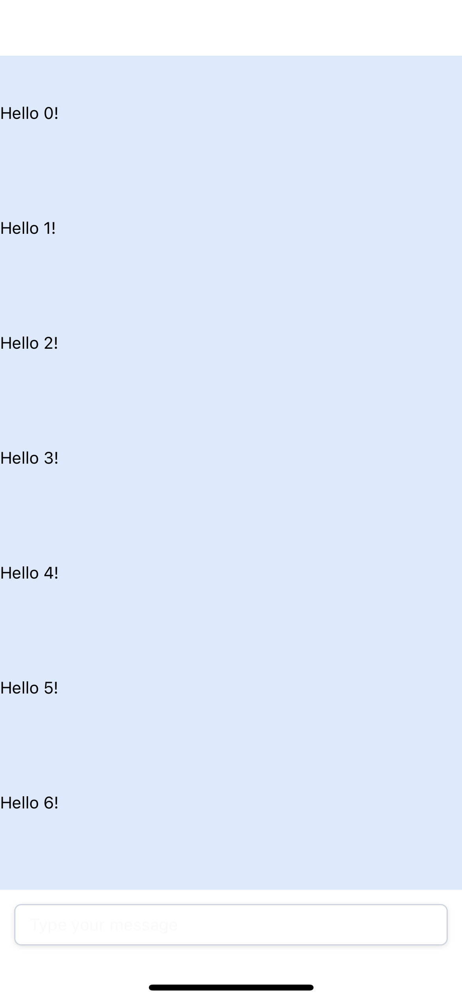
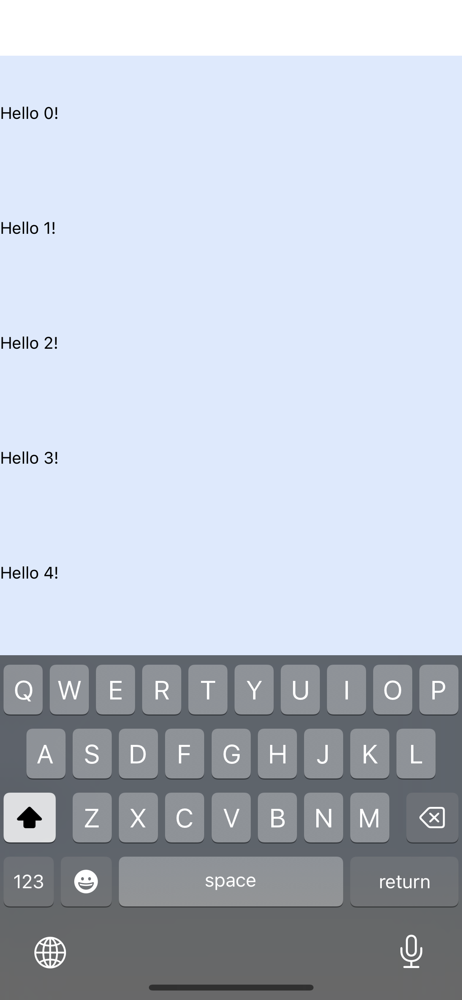

# To Reproduce Problem:

    npx expo start

then run it on your iOS device

# Problem 1

Clicking on the input element at the bottom of the screen causes the virtual keyboard to slide up as expected, but the input is now hidden by the virtual keyboard.

# Problem 2

As new messages get added to the screen, the `KeyboardAwareScrollView` does not auto scoll to the reveal the latest message.
